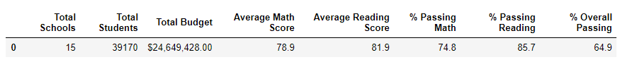
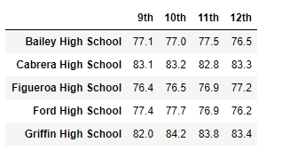

# School_District_Analysis

## Overview of School District Analysis
A school board detects evidence of academic dishonesty; specifically, reading and math grades for Thomas High School ninth graders which appear to have been altered. Although the school board does not know the full extent of the academic dishonesty, and to uphold state-testing standards, this analysis will:

 * Replace ninth-grade reading and math scores with NaNs while keeping the data intact.
 * Summarize district metrics
 * Summarize school metrics
 * The average math score for each grade level from each school.
 * The average reading score for each grade level from each school.
 * The scores by school spending per student, by school size, and by school type.
 
 (For the purposes of this analysis "Initial" means before data clean up and "New" means after data clean up. Data clean up is: replaced ninth-grade reading and math scores with NaNs while keeping the data intact.)

## Resources
-Data Source: Resources/schools_complete.csv, Resources/students_complete.csv

-Software: Jupyter Notebook

## Results 
Before the data clean up, the total student count was 39,170; after the data clean up (replaced ninth-grade reading and math scores with NaNs) the new total student count is 38,709. 

### District Summary 
The district summaries below shows a difference in score and percentages:
 * "Average Math Score" .1 difference 
 * "% Passing Math" .2 difference 
 * "% Passing Reading" .3 difference 
 * "% Overall Passing" .1 difference 
 
Initial District Summary 
 

New District Summary
 

### School Summary 
The school summaries 
Initial School Summary 
 

New School Summary

*How does replacing the ninth graders’ math and reading scores affect Thomas High School’s performance relative to the other schools?

*How does replacing the ninth-grade scores affect the following:

  *Math and reading scores by grade
  
  
  
  
  
  *Scores by school spending
  
  
  
  *Scores by school size
  
  
  
  *Scores by school type
  
  
  
## Summary 
Summarize four major changes in the updated school district analysis after reading and math scores for the ninth grade at Thomas High School have been replaced with NaNs.
