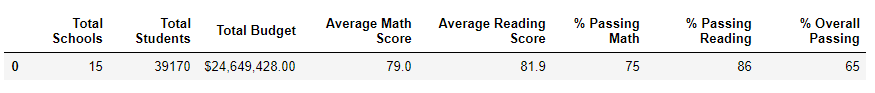
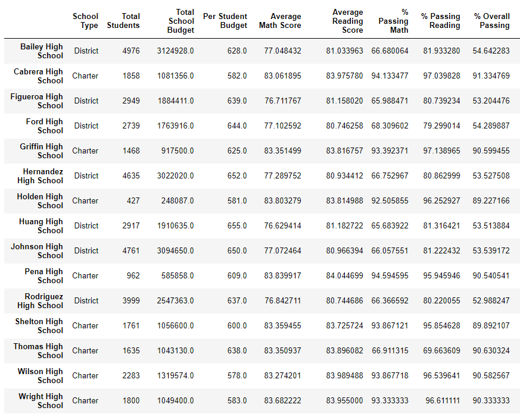
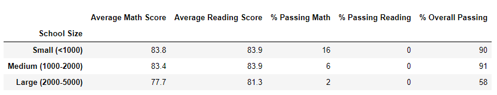

# School_District_Analysis

## Overview of School District Analysis
A school board detects evidence of academic dishonesty; specifically, reading and math grades for Thomas High School ninth graders which appear to have been altered. Although the school board does not know the full extent of the academic dishonesty, and to uphold state-testing standards, this analysis will:

 * Replace ninth-grade reading and math scores with NaNs while keeping the data intact.
 * Summarize district metrics
 * Summarize school metrics
 * Top five high and low performing high schools 
 * The average math score for each grade level from each school.
 * The average reading score for each grade level from each school.
 * The scores by school spending per student, by school size, and by school type.
 
_(For the purposes of this analysis "Initial" (I) means before data clean up and "New" (N) means after data clean up. Data clean up = replaced ninth-grade reading and math scores with NaNs while keeping the data intact. The initial and new data was analyzed between two files to avoid errors.)_

## Resources
-Data Source: 
* Resources/schools_complete.csv  
* Resources/students_complete.csv

-Software: Jupyter Notebook

## Results 
Before the data clean up, the total student count was 39,170; after the data clean up (replaced ninth-grade reading and math scores with NaNs) the new total student count is 38,709. 

### District Summary 
The district summaries below show a difference in math score and math and reading percentage when comparing the initial scores and percentages to the new score and percentages
:
 * "Average Math Score" = .1 difference (I- 79.0 to N- 78.9)
 * "% Passing Math" = I- 75% to N- 74.8%
 * "% Passing Reading" = I- 86% to N- 85.7%
 * "% Overall Passing" = I- 65% to N- 64.9%)
 
**Initial District Summary 

 

**New District Summary

 

### School Summary 
Based on the tables below, the new school summary was affected in average math and reading scores, percentage passing math, percentage passing reading and percentage overall passing:

 * "Average Math Score" = .1 difference (I- 83.4 to N- 83.3)
 * "Average Reading Score" = .1 difference (I- 83.8 to- 83.9) 
 * "% Passing Math" = I- 5.704720 % to N- 1094.000000 %
 * "% Passing Reading" = I- 0.000595 % to N- 97.018739	%
 * "% Overall Passing" = I- 90.948012 % to N- 90.630324 %

**Initial School Summary 

 

**New School Summary

### Thomas High School Performance Relative to Other Schools 
In relation to other schools, replacing the ninth graders' math and reading scores at Thomas High School affected the school's math percentage, however, Thomas High School remains second in the "top five" high performing schools. 

*  Math score = .1 difference (I- 83.4 to N- 83.3)

**Initial Top Performing Schools

**New Top Performing Schools

 
**Math and Reading Scores by Grade

By replacing the ninth-grade math and reading scores, tenth-grade, eleventh-grade and twelfth-grade reading scores by grade at Thomas High School are affected:

 *  Reading score for tenth graders' = .3 difference (I- 84.3 to N- 84.0)
 *  Reading score for eleventh graders' =  .1 difference (I- 83.6 to N- 83.5)
 *  Math and reading scores for twelfth graders' shows no affect.

**Initial Math Score by Grade

 
**New Math Score by Grade

  
**Initial Reading Score by Grade

**New Reading Score by Grade

  
 **Scores by School Spending
 (Thomas High School per student spending is $634)
 
By replacing the ninth-grade math and reading scores, tenth-grade, eleventh-grade and twelfth-grade math and reading scores by school spending at Thomas High School shows no affect.

**Initial Score by Spending

**New Score by Spending 

  
 **Scores by School Size
 Thomas High School - Medium (student count 1632)
 
By replacing the ninth-grade math and reading scores, the average math and reading scores by school size among tenth, eleventh and twelfth graders' at Thomas High School is affected: 

*  Math score = .1 difference (I- 83.3 to N- 83.4)
*  Reading score = .1 difference (I- 83.9 to N- 83.8)  
 
**Initial Score by School Size

 
 
**New Score by School Size

 
  
 **Scores by School Type
 Thomas High School school type - Charter 
 
By replacing the ninth-grade math and reading scores, the average math and reading scores by school type among tenth, eleventh, and twelfth graders' at Thomas High School show no affect. 

**Initial Score by School Type

 
 
 **New Score by School Type
 
 
  
## Summary 
After reading and math scores for the ninth grade at Thomas High School have been replaced with NaNs, the updated district analysis referenced as "new" or (N), shows four changes the school board may want to take a closer look at: the district summary, top performing schools, math score by grade, and math and reading scores by school size. 

